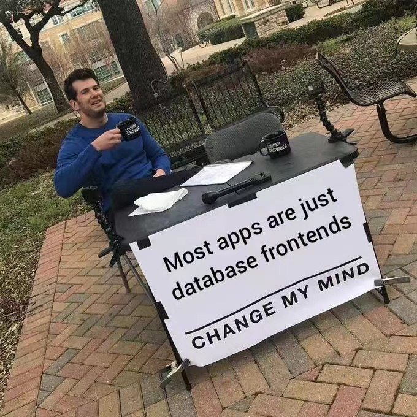

# 做一个天气查询的 TUI 程序

**目标驱动** - 逐步逐步做成这个 `TUI` 程序

## 起因

前几天逛 [0xFFFF](https://0xffff.one/d/1595-wei-shen-me-wo-zhe-teng-zhei-xie/7) 社区，看到一个帖子 - [为什么我折腾这些小众技术？](https://0xffff.one/d/1595-wei-shen-me-wo-zhe-teng-zhei-xie/7)，主要有个回复让我脑子有点想法 -- 「 现在 GitHub 上出现了这么多活跃的 TUI 项目（支持显示全彩全分辨率图片甚至播放视频的 Terminal、IDE、漂亮的 TUI 文件管理器、音乐播放器等等），反倒是计算机届的文艺复兴了。 」

了解我开发习惯的就知道，我挺喜欢在终端 `Terminal` 下完成一些工作，就心想要不我也开发个小小 TUI 程序用用。

> 写该文的时候，`Vim` 的创作者 `Brarm Moolenaar` 去世了，这里 **RIP** 下，毕竟自大二起就使用着 `Vim`，这个东西对我开发真是非常便捷，感谢 `Brarm Moolenaar` 的贡献。

就想着可以做个简单天气查询的 TUI 程序。

因为我目前办公的位置离窗边蛮远，且现在天气热，太阳晒，全都拉上窗帘，我就看不见窗外啥天气了。

某日中午出去吃饭，居然下太阳雨，直接淋成「 落汤鸡 」。

同样的悲催事可不能再遭遇一次，现在离开座位，要出办公楼前，必看看天气预报，决定是否带个雨伞。

一般我看天气的步骤如下：

1. 拿起手机解锁
2. 滑到最左边的天气界面

那我想更懒惰点，反正每一天下来，我对着电脑比对着手机更多，且我每台电脑的终端我都不会关掉的，常驻后台。

不如做个 TUI 程序，这样我想查看天气的时候，步骤就变成了：

1. 快捷键唤起终端
2. 输入命令，按下回车，就可看到天气信息

且这样我每天就可以少拿起手机了。因为怎么说，我有时拿起手机看个天气，有可能不知不觉的刷了「 亿 」会儿手机，那放下手机，回到电脑前继续做些事情，脑子又可能会有点小卡壳，不知道自己刚才在干嘛（如果在敲代码，又可能会忘了某一个逻辑是要怎么做的，要花些时间回忆下）。

不过其实这影响也不大，只是我想着如果把工作任务早点做完，那我摸鱼就摸的更心安理得，好像更不错耶。（￣︶￣）↗

**OK 清楚目标了，那就开始吧!**

## 思考下吧！

### 理解业务

这个东西的展现形态为一个 `Terminal` 下即可运行的程序。

运行这个程序，会显示我所在地的天气情况。

问题来了 - 我想要看到什么样的天气信息呢？

明确下要展示的天气信息：

1. 目前天气情况，即运行该程序那时刻的天气是咋样的，我要知道

2. 未来天气情况，即未来几个小时或几天内的天气情况，我想知道

### 确定所用技术栈

我作为一个开发者，我掌握着什么样的技术栈，做这个东西用什么技术比较合适，这些要确定下来。

如果是在 `Terminal` 下运行的程序，那用很多语言都可以完成的，只不过我最近常用一门叫 `Rust` 的语言。

下面是我问 ChatGPT，用 `Rust` 做命令行程序的优势是什么，它给出的回答。见仁见智啦！

```markdown
Rust 作为一种现代的系统级编程语言，拥有许多优势，使其成为开发命令行程序的理想选择。以下是 Rust 在开发命令行程序方面的一些优势：

1. 性能：Rust 是一门性能优秀的语言，它的执行速度接近于 C 和 C++，这使得命令行程序在处理大规模数据和复杂计算时表现出色。

2. 安全性：Rust 的所有权和借用系统能够在编译时检查内存安全性和数据竞争，有效地避免了许多常见的运行时错误和安全漏洞，使得命令行程序更加健壮和安全。

3. 并发支持：Rust 内置了对并发编程的支持，可以轻松地编写多线程的命令行程序，充分利用现代多核处理器的性能优势。

4. 轻量级：Rust 的标准库非常精简，这使得生成的可执行文件相对较小，节省了系统资源，并且适合用于开发轻量级的命令行工具。

5. 跨平台支持：Rust 提供了广泛的平台支持，可以轻松地在不同操作系统上运行编译好的命令行程序，这为开发跨平台工具提供了便利。

6. 依赖管理：Rust 的包管理器 Cargo 提供了简单易用的依赖管理功能，可以方便地引入外部库和工具，加速开发过程。

7. 社区和生态系统：Rust 社区非常活跃，并且拥有丰富的生态系统，你可以轻松地找到许多现成的库和工具，以及丰富的文档和教程，帮助你更高效地开发命令行程序。

综上所述，Rust 的性能、安全性、并发支持和跨平台能力使其成为开发命令行程序的优秀选择。无论是开发简单的工具还是复杂的命令行应用，Rust 都能够提供高效、安全和可靠的解决方案。
```

接下来就是**关键的环节**。

### 把业务需求翻译成技术需求



**开发前准备相关资源**

我这里的数据是有关天气的，那我就需要一个天气数据源。

这个网上选择很多，我这里用的是[心知天气](https://www.seniverse.com)，调用它提供的 API 返回的数据格式为 `JSON` 类型，便于处理。

---

梳理出技术需求吧！

1. 调用心知天气的 API，获取天气数据；Rust 有提供 `reqwest` 库，可以用来发起网络请求；

2. 能处理返回来的 `JSON` 数据，Rust 有提供 `serde` 库，可以用来处理 `JSON` 数据；

3. 制作成一个命令行程序，要考虑命令行程序的一些特点，比如：命令行参数的处理，以及提供 `--help` 的选项让使用者清楚该程序的使用方法；

## 动起手来吧！

> 指挥下 ChatGPT 帮我写些代码 (〃∀〃)

> 我好懒～～～

```c++
do {
    把我的技术需求输入给 ChatGPT;

    它负责具体实现;

    我 Code Review 它给我展示的代码;

    if (我满意了) {
      break;
    }
} while(我不满意)
```

> 最喜欢 `Code Review` 这件事情。现在平日开发，自己提升最多的一个环节就是在 `Code Review` 这里。

最终呈现出来的代码就是这个仓库 - [weather_cli](https://github.com/kok-s0s/weather_cli)

代码很简单的，非常直白。

## End

文章字数不多，就是叙述我完成这个目标（做一个天气查询的 `TUI` 程序）的一个过程。我给自己制定的目标去驱动我去完成这个事情，这个过程中，我也算学到了一些新知识（和 ChatGPT 对话学到的）。

再说说我现在开发的一些感受，软件开发需要你是怎么样的?

假如有个任务给你了，你应该：

1. 理解业务，这件事是什么？

2. 沟通上下游，现在基本都会有的。目前这时代绝非一个靠单打独斗就能做成一些事情的时代啦。

3. 做成这件事，是不是会要对某些编程语言和技术栈熟悉，要清楚是什么，如果有不会的，那就去学得了。要相信自己的学习能力。

4. 在理解业务的前提下，去把业务需求翻译成技术需求，最好梳理出的技术需求是层层递进的，这样自己慢慢实现了一个个技术需求，就能得到一个反馈，清楚自己离那个最终待解决的目标还有多远。

5. 有一点点的算法能力，有些问题的解决额外需要数学知识。本科生推荐必学「 高等数学 && 线性代数 && 数论 && 初高中三角函数知识也可别忘了（如果做 Qt 绘图会用到）」。

> 注意我这里说的是「 **必** 」哦，我个人啊，我个人啊，就建议是必学。疑惑的话，我只能说现实就是残酷呀，目前感觉绝大数程序员的差异化就在这些部份上，不认同的，也请当我乱说。毕竟就我来说啊，数学这部分外的一些什么新框架，什么新技术啦，我都是上 YouTube 上看印度老哥讲解学会的（dddd），或者直接看官方技术文档就行啦。


6. **多喝水**！**心态好**！**坐久了就站起来动动**！尽可能挖掘出做这件事的乐趣。很难说，就一种开发的感觉，进入「 心流状态 」，这说法合适吗？呀，真不好描述。文笔烂。

---

总之，Have Fun！

Just For Fun！
